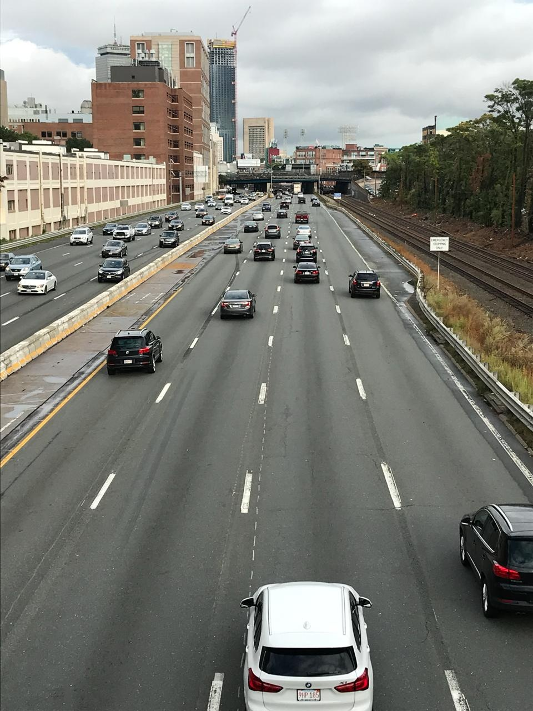

# Car detection using deep learning with OpenCV and Python 

 ## Dependencies
  * opencv-python==3.4.2.17
  * picamera
  * numpy
 
 ## Configuration
 # Clone the repository on the raspberry pi
 `git clone https://github.com/sshong19/CarDetection.git`
 If your raspberry pi doesn't have git installed, you can use scp or smtp to transfer files from your local machine to raspberry pi
 
 # Move to the project directory
 `cd ./CarDetection/yolo_detection`
 
 # Install necessary dependencies in Python 3.5
 `pip3 install -r requirements.txt `
 
 # Run the python script
 `$ python3 yolo_opencv.py --config yolov3-tiny.cfg --weights yolov3-tiny.weights --classes yolov3.txt`
 
 
 ### sample output image :
 
 
 ### sample output text :
 ```
 cars: 0 trucks: 0 bikes: 0 time: 2018-09-20 16:52:56.346913
 cars: 0 trucks: 0 bikes: 0 time: 2018-09-20 16:58:44.986554
 cars: 1 trucks: 0 bikes: 0 time: 2018-09-20 16:59:57.348698
 cars: 1 trucks: 0 bikes: 0 time: 2018-09-20 17:00:26.892457
 cars: 1 trucks: 0 bikes: 0 time: 2018-09-20 17:00:56.232055
 cars: 1 trucks: 0 bikes: 0 time: 2018-09-20 16:31:18.012034
 cars: 2 trucks: 0 bikes: 0 time: 2018-09-20 16:31:47.153710
 cars: 1 trucks: 0 bikes: 0 time: 2018-09-20 16:32:16.245184
 cars: 4 trucks: 0 bikes: 0 time: 2018-09-20 16:32:46.979363
 cars: 3 trucks: 0 bikes: 0 time: 2018-09-20 16:33:16.066405
 cars: 3 trucks: 0 bikes: 0 time: 2018-09-20 16:33:45.944274
 cars: 4 trucks: 0 bikes: 0 time: 2018-09-20 16:34:15.841824
 ```
 
 
 
 (**SSD and Faster R-CNN examples will be added soon**)
